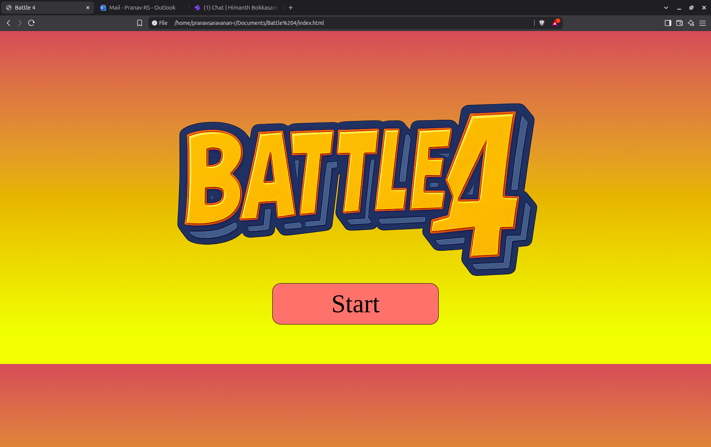
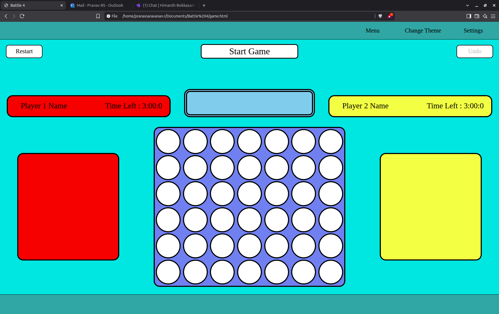

# Connect 4: Power-Up Edition

Welcome to **Connect 4: Power-Up Edition**, a browser-based twist on the classic Connect 4 game. Built with **HTML**, **CSS**, and **JavaScript**, this game enhances traditional gameplay with modern UI, colorful themes, and strategic power-ups.

---

## Gameplay

* **Board Size**: 7 columns × 6 rows
* **Goal**: Connect four of your discs horizontally, vertically, or diagonally.
* **Twist**: Use power-ups to block, remove, or reverse moves, making every match unpredictable.

---

## Features

### Core Mechanics

* Click-based column selection
* Hover indication with live highlighting
* Full win detection logic for all directions

### Power-Ups

* **Remove Blockage**: Clear a blocked column
* **Random Disc**: Random Disc falls for you
* **Time Decrease**: Reduce 10 Seconds for your Opponent
* **Time Increase**: Increase 15 Seconds for your Opponent

### Themes & Styling
* Light and Dark Mode

### Sounds
* Has Background and Game Sounds

## 👨‍💻 Made With

* Vanilla JavaScript
* Pure HTML/CSS

---
